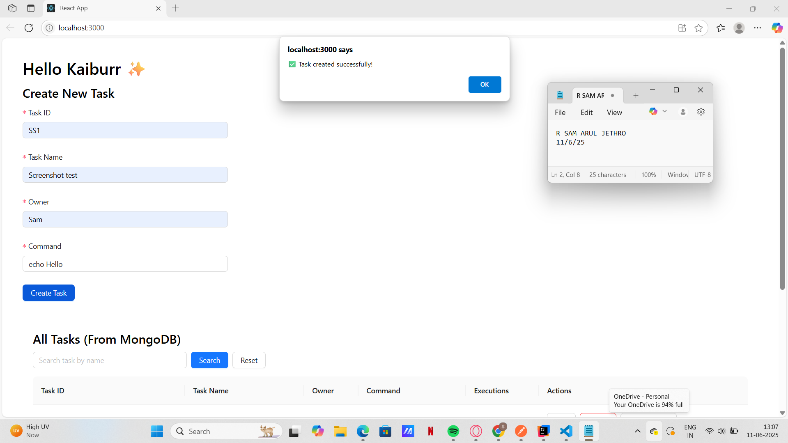

# Kaiburr Task 3 – React UI

This project is part of the Kaiburr 2025 Assessment.  
It is a frontend web application built using **React 19**, **TypeScript**, and **Ant Design**, connected to the backend from Task 1 (Spring Boot + MongoDB).

---

## ✅ Features Implemented

- Create a new task (ID, name, owner, command)
- View all tasks from MongoDB
- Search tasks by name
- Delete a task
- Run a shell command on a task
- View the command output in a popup modal

---

## ⚙️ How to Run the App

### 🧑‍💻 Prerequisites
- Node.js and npm installed
- Backend (Task 1 Spring Boot app) running at `http://localhost:8080`

### ▶️ Steps to Start the App

```bash
npm install
npm start
```

The app will open in your browser at:  
[http://localhost:3000](http://localhost:3000)

---

## 🔗 Backend Connection

This React app connects to the backend built in Task 1.  
It sends requests to the Spring Boot APIs running at:

```
http://localhost:8080
```

---

## 📸 Screenshots

1. **Create Task (Form Submission)**  
   

2. **Task Table with Output Modal**  
   

📌 Screenshots include developer name and system clock.

---

## 🎥 Demo Video

Watch the app in action:  
[Click to view demo](./demo/demo.mp4)

---

## 👤 Developer

**Sam Arul Jethro**  
Kaiburr 2025 Assessment – Task 3 Submission
